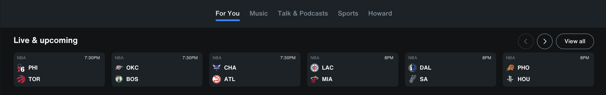
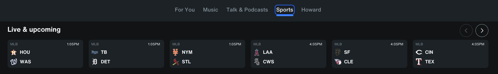

+++
title = "Live Upcoming events"
weight = 3
chapter = true
+++

# Live upcoming events API

- [Smithy Contract](https://ghe.siriusxm.com/platform-common/api-registry/blob/main/smithy/contentservices/recommender/api/public/recommendations.smithy#L332)
- [Swagger Documentation](https://ghe.siriusxm.com/pages/platform-common/api-registry/swagger/index.html?url=/pages/platform-common/api-registry/openapi/contentservices.recommender.api.public/RecommendationsApi.json#/default/GetLiveAndComingEventContainer)
- [Datadog](https://app.datadoghq.com/apm/entity/service%3Arecommender-service?dependencyMap=qson%3A%28data%3A%28telemetrySelection%3Aall_sources%29%2Cversion%3A%210%29&deployments=qson%3A%28data%3A%28hits%3A%28selected%3Aversion_count%29%2Cerrors%3A%28selected%3Aversion_count%29%2Clatency%3A%28selected%3Ap95%29%2CtopN%3A%215%29%2Cversion%3A%210%29&env=test&fromUser=false&groupMapByOperation=null&operationName=netty.request&panels=qson%3A%28data%3A%28resource%3A%28resourceName%3AGET%2520%252Fpublic%252Fv1%252Frecommender%252Fv1%252Fcontainer%252Flive-upcoming-events%2CresourceID%3A680c8bc9f1286668%29%2CactivePanelKey%3Aresource%29%2Cversion%3A%210%29&resources=qson%3A%28data%3A%28visible%3A%21t%2Chits%3A%28selected%3Atotal%29%2Cerrors%3A%28selected%3Atotal%29%2Clatency%3A%28selected%3Ap95%29%2CtopN%3A%215%2Csearch%3Alive%29%2Cversion%3A%211%29&summary=qson%3A%28data%3A%28visible%3A%21t%2Cchanges%3A%28%29%2Cerrors%3A%28selected%3Acount%29%2Chits%3A%28selected%3Acount%29%2Clatency%3A%28selected%3Alatency%2Cslot%3A%28agg%3A95%29%2Cdistribution%3A%28isLogScale%3A%21f%29%2CshowTraceOutliers%3A%21t%29%2Csublayer%3A%28slot%3A%28layers%3AserviceAndInferred%29%2Cselected%3Apercentage%29%2ClagMetrics%3A%28selectedMetric%3A%21s%2CselectedGroupBy%3A%21s%29%29%2Cversion%3A%211%29&traces=qson%3A%28data%3A%28%29%2Cversion%3A%210%29&start=1741782335659&end=1741785935659&paused=false#resources)
- [Edge Config](https://ghe.siriusxm.com/core-services/edge-gateway/blob/main/services/krakend/config/settings/consolidated/settings.json#L7920)

## API Overview

**URL**: `recommender/v1/container/live-upcoming-events`  
**Method**: `GET`  
**Cache-Control**: `max-age=300`  
**Page Limit**: 250  
**Previous Versions**: No

The API retrieves live and upcoming events based on the provided parameters. It processes event data from the catalog, applies filters, sorts the results, and returns a paginated response.  
**Note**: The response is generic for all users, and `profileId` is not considered for fetching the details.

## Request Parameters

Refer to the [Swagger](https://ghe.siriusxm.com/pages/platform-common/api-registry/swagger/index.html?url=/pages/platform-common/api-registry/openapi/contentservices.recommender.api.public/RecommendationsApi.json#/default/GetLiveAndComingEventContainer) for all request parameters. Below are the key parameters that impact the API response:

| Parameter | Type | Source | Required | Description |
|-----------|------|--------|----------|-------------|
| `containerId` | String | QueryString | Yes | Page container ID |
| `x-sxm-upsell-channel-lineup-id` | Integer | Header/Token | Yes | Entitlements |
| `currentPage` | Integer | QueryString | Yes | Page number for pagination |
| `useCuratedContext` | Boolean | QueryString | No | Curated context (True/False) with page info |
| `entityId` | String | QueryString | No | Get events specific to that ID (e.g., leagues, teams) |
| `entityType` | String | QueryString | No | Entity type |
| `supportedMediaType` | List | QueryString | No | Supported media types (Audio, Video) |
| `today` | Boolean | QueryString | No | Always False (not passed) |


## Sample Response

**Status**: `200 OK`

```json
{
  "container": {
    "sets": [
      {
        "items": [],
        "type": "SET",
        "id": "56frvcP3iDdokrrOplIALB",
        "texts": {
          "title": {
            "default": "NFL Primetime TEST",
            "long": "",
            "medium": "",
            "short": ""
          },
          "subtitle": {
            "default": "Testing the NFL Primetime with league curated context"
          }
        },
        "pagination": {
          "offset": 0,
          "size": 0
        },
        "style": {
          "name": "scores"
        }
      }
    ],
    "id": "3NoLxLTdTWMOtQXA7IpuJ0",
    "type": "CONTAINER"
  }
}
```


## Postman Collections
You can access the Postman collections [here](https://siriusxm.postman.co/workspace/Recommender-Team-Workspace~f4a7157f-6cae-4d87-9613-8a57aba7a54d/folder/38628711-df2d80b5-c861-4ede-b9b7-74e84afb7cf8).

## Business Logic & Rules

The API determines event retrieval based on various contextual parameters. Below are the five possible outcomes based on the request type.

### 1.1 Curated Context with `containerId`

- **Applies to**: "For You" and "Sports" pages.
- **Curated Context**: `true`.
- **Function**: Fetches all future events based on items from the page, considering the `containerId`.


#### Example Scenarios:

| Scenario    | Container (containerId)                                                                                                                               |
|-------------|------------------------------------------------------------------------------------------------------------------------------------------------------|
| For You     | [3NoLxLTdTWMOtQXA7IpuJ0](https://app.contentful.com/spaces/0wulllbbcweu/environments/test/entries/3NoLxLTdTWMOtQXA7IpuJ0)                           |
| Sports Page | [7tMHtZgHYwI21psA9001O0](https://app.contentful.com/spaces/0wulllbbcweu/environments/test/entries/7tMHtZgHYwI21psA9001O0), [7aUDCGOaHO5xzzNTP1lNvV](https://app.contentful.com/spaces/0wulllbbcweu/environments/test/entries/7aUDCGOaHO5xzzNTP1lNvV) |




#### Workflow Steps

If `curatedContext` is enabled and a `containerId` is provided, below steps are done:

1. **Retrieve Page Items**
  - Fetch page items using the provided `containerId`.
  - Only consider items from the first page set for **single** and **set_pool**.
  - No filtering on page set items based on entity types.
  - Fetch catalog details for all page set items and apply filtering based on the criteria below.

2. **Fetch & Filter Catalog Items**
  - Apply the following filtering criteria:
    - **Event Type**: Only events.
    - **Exclude**: Placeholders, satellite-only items, non-discoverable, non-recommendable, and non-visible items.
    - **Media Type**: Audio and video.
    - **Expiration Time**: Must be in the future, if it exists.
    - **Start Time**:
      - If missing or invalid (unable to parse), consider it valid.
      - If present, it must be greater than the current time or within a buffer of 5 hours.

3. **Sort & Pagination**
  - Sort the filtered items by start time.
  - Remove duplicates.
  - Apply pagination.


4. **Apply Additional Filters**
  - **For Play-by-Play Events**:
    - Include only events that are pre-game, scheduled, delayed, or in progress.
    - Ensure `eventStartTime` is after the current time.
  - **Fast Filtering**:
    - Apply checks for media types, validity, and channel lineups.

5. **Build & Decorate**
  - **Build**: Construct items with channel lineups.
  - **Decorate**: Apply `getSxmSet` for final processing.

---

### 1.2 Events for a Specific League

- **Function**: Fetches all events for a specific league.
- **Curated Context**: `false` (not curated).
- **Parameter**: `tagCategoryId` is passed, driven by the league and its `entityId`.

#### Example Scenarios:

- **User selects an NBA league** → API fetches all upcoming NBA events. (Not sure how to get to this in UI)

#### Workflow Steps

##### Fetch & Filter Catalog Items

- Retrieve all events for the provided league id from catalog
- Apply filtering based on the following criteria:
    - **Event Type**: Only events.
    - **Exclude**: Placeholders, satellite-only items, non-discoverable, non-recommendable, and non-visible items.
    - **Media Type**: Audio and video.
    - **Expiration Time**: Must be in the future, if it exists.
    - **Start Time**:
        - If missing or invalid (unable to parse), consider it valid.
        - If present, it must be greater than the current time or within a buffer of 5 hours.
    - **Tag Category**: Check if the events are under the provided tag category.

##### Sort & Pagination

- Sort the filtered items by start time.
- Remove duplicates and apply pagination.

##### Apply Additional Filters

- **For Play-by-Play Events**:
    - Include only events that are pre-game, scheduled, delayed, or in progress, and where `eventStartTime` is after the current time.

- **Fast Filtering**:
    - Apply checks for media types, validity, and channel lineups.

##### Build & Decorate

- **Build**: Construct items with channel lineups.
- **Decorate**: Apply `getSxmSet` for final processing.

---

### 1.3 Not Curated, No Entity Provided

- If no entity information is provided in the request, the API fetches all events across all leagues.[League Map](https://ghe.siriusxm.com/content-services/recommender-service/blob/f68f4079792a782c9de88055568694d662b37895/recommender-service/src/main/java/com/siriusxm/contentservices/rs/utils/ConstantUtils.java#L65)

#### Example Scenarios:

- **User requests without specifying a league or team** → API returns events for all available leagues.  
  (Not sure how to get to this in UI)
#### Workflow Steps

##### Fetch & Filter Catalog Items

- Retrieve all events for the all the leagues from catalog.
- Apply filtering based on the following criteria:
    - **Event Type**: Only events.
    - **Exclude**: Placeholders, satellite-only items, non-discoverable, non-recommendable, and non-visible items.
    - **Media Type**: Audio and video.
    - **Expiration Time**: Must be in the future, if it exists.
    - **Start Time**:
        - If missing or invalid (unable to parse), consider it valid.
        - If present, it must be greater than the current time or within a buffer of 5 hours.


##### Sort & Pagination

- Sort the filtered items by start time.
- Remove duplicates and apply pagination.

##### Apply Additional Filters

- **For Play-by-Play Events**:
    - Include only events that are pre-game, scheduled, delayed, or in progress, and where `eventStartTime` is after the current time.

- **Fast Filtering**:
    - Apply checks for media types, validity, and channel lineups.

##### Build & Decorate

- **Build**: Construct items with channel lineups.
- **Decorate**: Apply `getSxmSet` for final processing.

---

### 1.4 Non-League Entity

- Fetches events based on the provided entity, which is not a league.

#### Example Scenarios:

- **Fetch events for a specific team** instead of a league.

#### Workflow Steps

##### Fetch & Filter Catalog Items

- Retrieve all events for the given entityId from catalog
- Apply filtering based on the following criteria:
    - **Event Type**: Only events.
    - **Exclude**: Placeholders, satellite-only items, non-discoverable, non-recommendable, and non-visible items.
    - **Media Type**: Audio and video.
    - **Expiration Time**: Must be in the future, if it exists.
    - **Start Time**:
        - If missing or invalid (unable to parse), consider it valid.
        - If present, it must be greater than the current time or within a buffer of 5 hours.

##### Sort & Pagination

- Sort the filtered items by start time.
- Remove duplicates and apply pagination.

##### Apply Additional Filters

- **For Play-by-Play Events**:
    - Include only events that are pre-game, scheduled, delayed, or in progress, and where `eventStartTime` is after the current time.

- **Fast Filtering**:
    - Apply checks for media types, validity, and channel lineups.

##### Build & Decorate

- **Build**: Construct items with channel lineups.
- **Decorate**: Apply `getSxmSet` for final processing.

---
### 1.5 If Entity is Linked to an Experience ID

- If the entity is linked to an experience ID, fetches all events based on super category IDs.  
  [Super Category IDs](https://ghe.siriusxm.com/content-services/recommender-service/blob/f68f4079792a782c9de88055568694d662b37895/recommender-service/src/main/java/com/siriusxm/contentservices/rs/utils/ConstantUtils.java#L199-L201)
- If no events exist for the super category, the API falls back to fetching events for the default leagues: MLB, NFL, NBA, NHL.

#### Example Scenarios:

- **User requests events in an experience** → API first fetches related events.
- If no events exist, it defaults to MLB, NFL, NBA, NHL events.

#### Workflow Steps

##### Fetch & Filter Catalog Items

- Retrieve catalog details for all items based on super categoryIds or fallback leagues
- Apply filtering based on the following criteria:
    - **Event Type**: Only events.
    - **Exclude**: Placeholders, satellite-only items, non-discoverable, non-recommendable, and non-visible items.
    - **Media Type**: Audio and video.
    - **Expiration Time**: Must be in the future, if it exists.
    - **Start Time**:
        - If missing or invalid (unable to parse), consider it valid.
        - If present, it must be greater than the current time or within a buffer of 5 hours.

##### Sort & Pagination

- Sort the filtered items by start time.
- Remove duplicates and apply pagination.

##### Apply Additional Filters

- **For Play-by-Play Events**:
    - Include only events that are pre-game, scheduled, delayed, or in progress, and where `eventStartTime` is after the current time.

- **Fast Filtering**:
    - Apply checks for media types, validity, and channel lineups.

##### Build & Decorate

- **Build**: Construct items with channel lineups.
- **Decorate**: Apply `getSxmSet` for final processing.

---
## Testing

- **SonarQube for coverage**:  
  [SonarQube Link](https://sonarqube-enterprise.savagebeast.com/component_measures?id=ghe%3Acontent-services%3Arecommender-service&metric=new_coverage&view=list&selected=ghe%3Acontent-services%3Arecommender-service%3Asrc%2Fmain%2Fjava%2Fcom%2Fsiriusxm%2Fcontentservices%2Frs%2Fservices%2FRecommenderService.java)


## Notes

- Same sort and same filtering are used in multiple places.