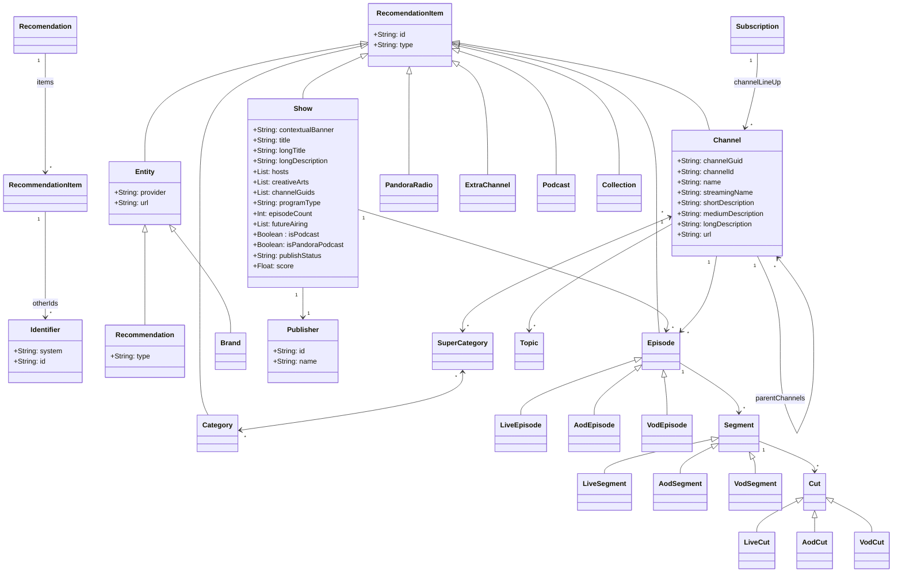

```mermaid
classDiagram

    class Identifier {
        +String: system
        +String: id
    }

    Entity <|-- Recommendation
    class Entity {
        +String: provider
        +String: url
    }

    Recomendation "1" --> "*" RecommendationItem : items

    class Recommendation {
        +String: type
    }

    RecomendationItem <|-- Show
    RecomendationItem <|-- Channel
    RecomendationItem <|--  Episode
    RecomendationItem <|-- PandoraRadio
    RecomendationItem <|-- ExtraChannel
    RecomendationItem <|-- Podcast
    RecomendationItem <|-- Category
    RecomendationItem <|-- Collection
    RecomendationItem <|-- Entity
    Entity <|-- Brand

    RecommendationItem "1" --> "*" Identifier : otherIds
    class RecomendationItem {
        +String: id
        +String: type
    }

    Show "1" --> "*" Episode
    Show "1" --> "1" Publisher

    class Show {
        +String: contextualBanner
        +String: title
        +String: longTitle
        +String: longDescription
        +List: hosts
        +List: creativeArts
        +List: channelGuids
        +String: programType
        +Int: episodeCount
        +List: futureAiring
        +Boolean : isPodcast
        +Boolean: isPandoraPodcast
        +String: publishStatus
        +Float: score
    }


    class Channel {
        +String: channelGuid
        +String: channelId
        +String: name
        +String: streamingName
        +String: shortDescription
        +String: mediumDescription
        +String: longDescription
        +String: url
    }

    Episode <|-- LiveEpisode
    Episode <|-- AodEpisode
    Episode <|-- VodEpisode
    Segment <|-- LiveSegment
    Segment <|-- AodSegment
    Segment <|-- VodSegment
    Cut <|-- LiveCut
    Cut <|-- AodCut
    Cut <|-- VodCut


    class Episode {
    }

    class AodEpisode {

    }

    class LiveEpisode {

    }

    class VodEpisode {

    }

    class Segment {

    }

    class LiveSegment {

    }

    class AodSegment {

    }

    class VodSegment {

    }

    class Cut {

    }

    class LiveCut {

    }

    class AodCut {

    }

    class VodCut {

    }

    Channel "1" --> "*" Episode
    Episode "1" --> "*" Segment
    Segment "1" --> "*" Cut

    Channel "1" --> "*" Channel : parentChannels
    Channel "*" <--> "*" SuperCategory
    SuperCategory "*" <--> "*" Category
    Channel "1" --> "*" Topic

    class SuperCategory {
    }

    class Category {
    }

    class Topic {
    }

    class Publisher {
        +String: id
        +String: name
    }


    class Subscription {
    }

    Subscription "1" --> "*" Channel : channelLineUp
```
